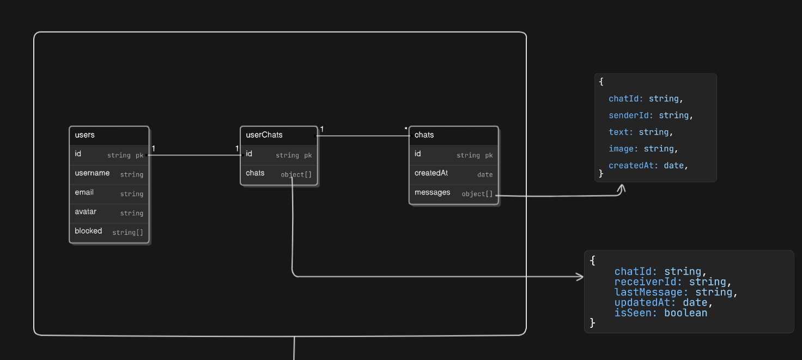
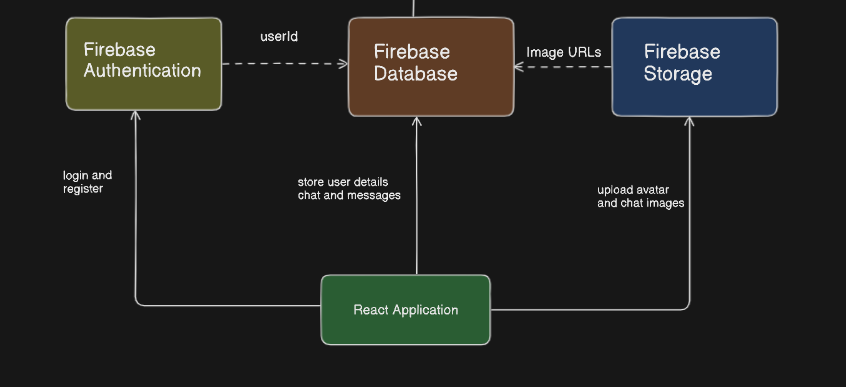

# Chat-Application
React based Chat application with Firebase.
Here, I'm going to use the firebase Authentication for login and register the user, firebase Database to store user details chats and messages, and firebase storage to upload avatar and chat images.
I'm going to store the image URL from Firebase Storage in the database, using the unique identifier from Firebase Authentication.

You can check the Basic Architecture here of the application:
https://app.eraser.io/workspace/qWMqUBrOAVOqTYWQPyNF?origin=share

This above is linked with this below image
